# Blueprint

The operating system for agentic software development.

AI agents do not fail because they are not smart enough. They fail because the work is not shaped correctly: no spec, no plan, no tests, no review, and no final quality gate. Blueprint fixes the shape of the work and trusts the model to do the thinking.

Blueprint encodes how strong engineering teams already ship: bootstrap cleanly, design when the architecture is unclear, spec when contracts and invariants matter, plan when the work needs to be split, test before ship, and review before merge.

The result is a unified operating model where Devin acts as the senior AI engineer: it owns the work from request to merge, delegates implementation to Claude, Codex, local models, or its own hands depending on the task, and personally tests and approves the final result. Linear is the source of truth for all work.

Blueprint is the deliberate opposite of bloated agent frameworks. No ceremony for its own sake. No guardrail mazes. No thousand-line prompt packs that burn context before work even starts. Simplicity is clarity: if a skill is short enough to hold in your head, an agent is more likely to follow it. Blueprint bets on the model. Heavy frameworks assume the model is weak and bury it in rules; Blueprint assumes the model is strong and gives it the judgment of a great senior engineer, written down. As models improve, that bet gets better.

For the CORE business operations framework (Charter, Orchestrate, Run, Evolve), see [AGENTS.md](AGENTS.md).

---

## The Model

Blueprint treats agentic development as a layered engineering system:

- **Devin** -- senior engineer, orchestrator, implementer, tester, and final reviewer
- **Linear** -- queue, ticketing, ownership, and status tracking
- **Claude / OpenAI automations** -- delegated execution for structured tasks and workflows
- **Local models (Kimi, GLM, etc.)** -- lightweight, private, cost-sensitive assistance in Devin local
- **CLI / automations** -- the mechanisms used to trigger work, run checks, and move tasks forward

Devin decides when to work directly and when to delegate. It handles ambiguous, high-context, or high-risk work itself. It uses other models when the work is repeatable, parallelizable, or better handled through automation.

---

## Principles

- **Encode process, not knowledge.** Skills are workflows. Reference material belongs elsewhere.
- **Verification is non-negotiable.** Tests prove behavior. Browser-rendered work is checked in a real browser with screenshots and video recordings. Review confirms the proof is real.
- **Bet on the model.** Use smart agents, not heavy guardrails. Better models need less scaffolding and more room to reason.
- **Density over length.** Skills should be as short as possible while still being clear.
- **Focused skills, not sprawling catalogues.** Saying no is part of the design.
- **Own the outcome.** Devin is responsible for the final result, not just the intermediate steps.
- **Reuse before you build.** Check existing scripts, knowledge, playbooks, and MCP tools before writing anything new.
- **Stay cost-aware.** Spend tokens where judgment matters most.
- **300 LOC maximum.** No source file should exceed 300 lines of code. Split by responsibility when a file crosses the limit.

---

## The CORE Loop

Blueprint operates within a four-stage closed loop. Each layer maps to a specific Devin artifact type:

| CORE Layer | Purpose | Artifact | Type |
| --- | --- | --- | --- |
| **Charter** | Define the work | `charter` | Skill |
| **Orchestrate** | Route to the right agent | `delegate` | Playbook (`!delegate`) |
| **Run** | Execute the work | SDLC skills | Skills |
| **Evolve** | Learn and write back | `retro` | Automation |
| **Evolve** | Self-heal mid-session | `anneal` | Knowledge |
| **Evolve** | Persist learnings | `knowledge-update` | Playbook (`!knowledge-update`) |

LLMs are probabilistic; most business logic is deterministic. CORE fixes that mismatch: you reason and route (Orchestrate), deterministic tools do the work (Run), and you write back what you learn (Evolve) so the system compounds.

For full CORE framework details, see [AGENTS.md](AGENTS.md).

---

## The Flow

```mermaid
%%{init: {"theme": "base", "themeVariables": {"fontFamily": "Inter, ui-sans-serif, system-ui", "fontSize": "18px", "primaryTextColor": "#f8fafc", "tertiaryTextColor": "#f8fafc", "lineColor": "#94a3b8", "edgeLabelBackground": "#020617"}}}%%
flowchart TD
    Request([Request: feature, bug, or brief])

    Triage["triage\nclassify, assess risk,\nroute to execution path"]

    Ambiguous{Is the architecture<br/>unclear?}
    Design["design-doc\noptions, tradeoffs,\nchosen direction"]

    SpecGate{Do contracts,<br/>invariants, or error behavior matter?}
    Spec["spec\nrequirements, implementation design,\nhuman review"]

    Split{Does the work need<br/>to be split?}
    Plan["plan\nagent-sized tasks,\nacceptance criteria"]
    Direct["one scoped task\nclear acceptance criteria"]

    Handoff["tickets and tasks\nready for execution"]

    Count{How many tickets?}
    Single["task-to-pr\nbranch, implement,\nreview, verify, PR"]
    Multi["multitask\nclassify, isolate,\ncoordinate workers"]
    PRs["draft PRs\ntests, review,\nacceptance evidence"]
    Ready["pr-to-ready\nfeedback to merge-ready,\nnever merge automatically"]

    Request --> Triage --> Ambiguous
    Ambiguous -->|yes| Design --> SpecGate
    Ambiguous -->|no| SpecGate
    SpecGate -->|yes| Spec --> Split
    SpecGate -->|no| Split
    Split -->|yes| Plan --> Handoff
    Split -->|no| Direct --> Handoff
    Handoff --> Count
    Count -->|one| Single --> PRs
    Count -->|many| Multi --> PRs
    PRs --> Ready

    classDef start fill:#0f172a,stroke:#38bdf8,stroke-width:3px,color:#f8fafc,font-size:18px;
    classDef triage fill:#1e1b4b,stroke:#818cf8,stroke-width:3px,color:#e0e7ff,font-size:18px;
    classDef decision fill:#431407,stroke:#fb923c,stroke-width:3px,color:#ffedd5,font-size:18px;
    classDef decide fill:#172554,stroke:#60a5fa,stroke-width:3px,color:#eff6ff,font-size:18px;
    classDef handoff fill:#4c1d95,stroke:#a78bfa,stroke-width:3px,color:#faf5ff,font-size:18px;
    classDef deliver fill:#052e16,stroke:#4ade80,stroke-width:3px,color:#f0fdf4,font-size:18px;
    classDef feedback fill:#831843,stroke:#f472b6,stroke-width:3px,color:#fdf2f8,font-size:18px;

    class Request start;
    class Triage triage;
    class Ambiguous,SpecGate,Split,Count decision;
    class Design,Spec,Plan,Direct decide;
    class Handoff handoff;
    class Single,Multi,PRs deliver;
    class Ready feedback;
```



Every request enters through `triage` first. Triage classifies the work (bug, feature, refactor, research, incident, infrastructure, coordination), assesses risk and scope, and routes to the right execution path. From there, the decision tree determines whether the work needs a design doc, a spec, a plan, or can go straight to implementation.

If implementation reveals the instructions are wrong, stop. Update the task, spec, charter, or plan first, then continue from the corrected source of truth. Do not push through stale instructions.

---

## The Shape

Blueprint organizes the software development lifecycle into a repeatable engineering sequence.

| Phase | Skill | What it does |
| --- | --- | --- |
| Charter | `charter` | Write or update a project charter (PRD for agents) with scope, goals, and success criteria. |
| Intake | `triage` | Classify the request, assess risk, and route to the right execution path. |
| Explore | `investigate` | Read-only codebase exploration: search, trace, understand, and report. |
| Design | `design-doc` | Explore architecture, alternatives, constraints, and tradeoffs. |
| Define | `spec` | Write requirements, contracts, invariants, and implementation boundaries. |
| Plan | `plan` | Break the work into small, agent-sized tasks with clear checkpoints. |
| Build | `implement` | Execute one task at a time; tests prove acceptance. Test-first when practical. |
| Debug | `debug` | Reproduce failures, fix them test-first when practical, and keep the guardrails intact. |
| Improve | `refactor` | Simplify changed code without changing behavior. Enforce 300 LOC file limit. |
| Review | `review` | Check correctness, security, simplicity, and merge readiness. |
| Deliver | `task-to-pr` / `multitask` | Turn one ticket or several tickets into draft PRs. |
| Feedback | `pr-to-ready` | Drive an open PR from human, bot, or check feedback to merge-ready. |

---

## Skills by Agent

### Devin (core skills)

These are the skills Devin uses directly. Devin has native browser, screenshot, video recording, branch management, and PR creation capabilities built in.

| Skill | What it does |
| --- | --- |
| `charter` | Write or update a project charter (PRD for agents). |
| `triage` | Classify the request, assess risk, and route to the right execution path. |
| `investigate` | Read-only codebase exploration and reporting. |
| `design-doc` | Write a lightweight architecture design doc when the design is ambiguous. |
| `spec` | Write the technical design before coding. |
| `plan` | Break a spec, brief, or request into agent-sized tasks. |
| `implement` | Execute one scoped change with tests and verification. Test-first when practical. |
| `debug` | Reproduce a failure, fix it test-first when practical, and keep the guardrails intact. |
| `refactor` | Simplify changed code without changing behavior. Enforce 300 LOC file limit. |
| `review` | Pre-merge review for correctness, security, simplicity, robustness, and tests. |
| `task-to-pr` | Run the full loop from Linear ticket to draft PR with verification and evidence. |
| `multitask` | Coordinate several tickets to draft PRs in parallel. |
| `pr-to-ready` | Drive an open PR from feedback to merge-ready. Never merges. |

### Claude Code / Codex (delegated agent skills)

These skills give Claude Code and Codex the explicit instructions they need to execute delegated work. Devin does not need these as standalone skills because it has native capabilities that cover them.

| Skill | What it does |
| --- | --- |
| `browser-verify` | Verify browser-rendered work using Chrome DevTools MCP. |
| `branch` | Create a traceable Git branch with the ticket ID when available. |
| `commit` | Stage intended changes and write one clear Conventional Commit. |
| `pr` | Commit, push, and open a clear draft PR. |
| `tdd` | Test-first variant of implement for enforcing test-first discipline. |
| `goal-design` | Write `/goal` prompts for Codex and Claude Code sessions with checks, evidence, and stop rules. |
| `test-before-pr` | Project-specific pre-PR verification (per-repo, not part of Blueprint core). |

#### Claude Code invocation

Blueprint workflows live in `skills/<name>/SKILL.md`. Invoke as:

`/blueprint:design-doc`, `/blueprint:spec`, `/blueprint:plan`, `/blueprint:implement`, `/blueprint:tdd`, `/blueprint:refactor`, `/blueprint:review`, `/blueprint:browser-verify`, `/blueprint:branch`, `/blueprint:commit`

`browser-verify` requires Chrome DevTools MCP. See [CLAUDE.md](CLAUDE.md) for Claude-specific adapter notes.

### CORE artifacts (non-skill)

These support the CORE loop but are not invoked as skills:

| Artifact | Type | Trigger | What it does |
| --- | --- | --- | --- |
| `delegate` | Playbook (`!delegate`) | When routing work to the fleet | Route a task to the right agent with inputs, outputs, and verification criteria. |
| `retro` | Automation | After every session | Review Session Insights, classify findings, propose Charter/Knowledge/Playbook updates. |
| `anneal` | Knowledge | When errors occur mid-session | Self-heal: fix, harden, test, write back. |
| `knowledge-update` | Playbook (`!knowledge-update`) | When a learning should persist | Draft a Knowledge note with semantic trigger and submit for review. |

---

## The Agent Fleet

Blueprint operates a tiered agent architecture. Devin is the lead engineer. Other models are tools in Devin's hands.

### Where Devin works directly

- ambiguous architecture or design decisions
- tricky debugging
- high-risk or security-sensitive changes
- final review and merge approval
- code that needs strong judgment or deep codebase context
- multi-constraint reasoning

### Where Devin delegates

- repetitive or parallelizable tasks
- structurally clear work with well-defined inputs and outputs
- tasks that follow an existing pattern or template
- work that is cheaper to run in a local or lightweight model

### The fleet

| Agent | Role | When to use |
| --- | --- | --- |
| **Devin (Cloud)** | Senior engineer, orchestrator, tester, reviewer | Heavy reasoning, ambiguous work, final review, merge decisions |
| **Devin (Local)** | Local-first execution with Kimi, GLM, or similar | Private work, cost-sensitive iteration, offline tasks |
| **Claude Code** | Implementation and review agent | Structured implementation, security review, correctness review |
| **Codex CLI** | Implementation agent via automations | Automation-triggered tasks, parallelized ticket work |
| **Venice** | Privacy-preserving LLM | Transcript analysis, private reasoning |

### The architecture

```
Manager Loop --> Orchestrator Loop --> Control Plane --> Evolve Loop
                       |                    ^
                  (does not engage)    (queries labels)
                       |                    |
                  Worker Loop --------------+
                       |
          +------------+------------+
          |            |            |
    Implementor    Reviewer    Tester Loop
    (Venice,       (Security,  (Devin Cloud)
     Claude Code,  Correctness)
     Codex, Devin) (Claude Code,
                    Codex)
```

The Orchestrator Loop writes labels and charters. The Control Plane tracks state. Workers query labels from the Control Plane, execute, and write retros back. The Evolve Loop reads session insights and proposes improvements.

---

## The Loops

The skills above are the building blocks. The loops connect them into end-to-end execution with clear checkpoints.

| Skill | From | To |
| --- | --- | --- |
| `task-to-pr` | a ticket | a draft PR with code, tests, fresh sub-agent review, acceptance verification, and evidence |
| `multitask` | several tickets | several draft PRs, one isolated worker lane per ticket or dependency group |
| `pr-to-ready` | an open PR with human, bot, or check feedback | a merge-ready PR with checks passing |

The loops keep the ticket current as they work: status changes, verification evidence is added, and PR links are recorded back on the ticket. They stop at human checkpoints. Merging is always a human decision.

`task-to-pr` is the single-ticket loop. It resolves the ticket, creates a branch, implements the acceptance criteria, reviews the diff, verifies the result, opens a draft PR, and writes evidence back to the ticket.

`multitask` is the coordinator-worker loop for multiple tickets at once. It classifies the work, isolates dependencies, launches one worker lane per ticket or ticket group, and returns several draft PRs with evidence. Each worker runs the full `task-to-pr` workflow. The coordinator does not edit code; it partitions work, starts isolated lanes, monitors failures, and reports the fleet.

`pr-to-ready` is the feedback loop for an open PR. It takes human feedback, bot feedback, or check failures, resolves what is needed, and drives the PR to merge-ready status without merging automatically.

---

## Running Unattended

The loops can run on a schedule over an issue tracker, with agents filing every issue. Work moves through three phases:

- **Ready**: turn ideas and specs into agent-ready issues. The agent filing an issue judges it at creation: decision-complete work gets `agent:ready`; a real problem with open decisions gets `needs:spec`, and the spec loop turns it into a reviewed spec.
- **Work**: a scheduled agent claims one `agent:ready` issue and runs `task-to-pr` to a draft PR, with the ticket as the audit trail. The loop throttles itself on review capacity: when too many agent PRs await review, it stops starting new work.
- **Review**: humans, review bots, and checks leave feedback. A review-watch loop runs `pr-to-ready` after a short grace window, repeats until the PR is ready or blocked, and a human merges.

Humans do three things: flip `needs:spec` to `agent:ready` after reviewing a spec, review PRs when judgment is needed, and merge. Agents do everything else.

---

## Verification Standard

Tests are the default verification path. The request or spec defines the testing strategy. The implementation should produce tests that prove the requirements. Browser-rendered work gets checked with Devin's native browser testing and video recording capabilities (see [Testing & Video Recordings](https://docs.devin.ai/work-with-devin/testing-and-recordings)). `task-to-pr` adds fresh acceptance verification against the ticket before opening a draft PR. Review checks that the proof is real, not theatre. If you want stronger code review expectations, put them in `REVIEW.md`; the `review` skill will pick them up.

A change is not done when the code exists. A change is done when:

- the ticket is current
- the implementation matches the request
- the behavior is verified
- the evidence is real
- the review is complete
- Devin is confident it should merge

---

## Agent Instructions

Blueprint turns external context into instructions for agents. The input can be a one-line prompt, a Linear ticket, a charter, a design doc, or a markdown spec in the repo. The format should match the work.

- Charters default to `charters/<project-slug>.md`.
- Design docs default to `docs/<design-slug>/design.md`.
- One spec per feature, at `docs/<feature-slug>/spec.md`.
- Plans default to `docs/<feature-slug>/plan.md`. Push tasks to Linear only when the user asks. When tasks go to Linear, the issues are the plan -- do not write a separate plan doc.
- Use the full pipeline for work that touches contracts, schemas, multiple files, or invariants.
- For trivial changes, just do the work.
- For exploration, use `investigate` without inventing fake specs, plans, or issue tracker entries.

---

## Philosophy

- **Specs are prompts with weight.** A spec is an instruction detailed enough to make decisions reviewable. Once the code is right, the spec's job is done.
- **Charters are PRDs for agents.** A charter defines what and why. Specs and plans define how.
- **Planning is not prompting.** Real planning already happens in issue trackers, docs, design reviews, meetings, and PRs. Blueprint distills that context into the instruction an agent needs.
- **Compress context.** Every word competes for attention. Remove restatements, overlap, padding, and preamble. Keep the constraints, names, commands, paths, schemas, and examples that matter.
- **Agent inputs only.** Blueprint is not an issue tracker, architecture board, or release process. It turns external context into high-quality instructions for coding agents. That is the entire job.

---

## Install

Set up Blueprint with the skills CLI:

```bash
npx skills add versusjl/devin-blueprint
```

This is the supported setup path. Blueprint does not maintain separate installation guides for individual tools.

For Claude Code / Codex browser verification, `browser-verify` requires Chrome DevTools MCP:

```bash
claude mcp add chrome-devtools --scope user npx chrome-devtools-mcp@latest
codex mcp add chrome-devtools -- npx chrome-devtools-mcp@latest
```

## Update

```bash
npx skills update
```

Run this to update Blueprint and your installed skills to the latest version.

---

## Example

The `core` folder contains sample Blueprint artifacts associate with a GTM .

- 
