# Label Reference

Labels are the control plane for Blueprint's unattended loops: each label marks a state or a property, and exactly one loop or human moves a ticket out of each state. This is the canonical reference; [loops.md](loops.md) shows the loops that act on them.

Labels live in Linear. The same namespaces and state machine apply regardless of which agent (Devin, Claude Code, Codex) is doing the work. Devin Automations trigger on label changes; the `!delegate` playbook routes work to the right agent based on label state and risk grade.

## Namespaces

Namespaces separate dimensions that flat labels mix together:

| Namespace | Dimension | Values |
|---|---|---|
| `agent:*` | The loop state machine | `ready`, `working`, `complete` |
| `needs:*` | What the ticket is waiting on | `spec`, `human`, `design` |
| `risk:*` | Autonomy gate: blast radius if the work goes wrong | `low`, `high` |
| `type:*` | Classification for reporting | `feature`, `bug`, `chore`, `refactor`, `research`, `incident`, `infrastructure` |
| `route:*` | Agent routing (Orchestrate layer) | `devin`, `claude`, `codex`, `local`, `child-session` |
| (none) | Dependency on another ticket | `blocked` |

`agent:*`, `needs:*`, and `blocked` drive the loops. `risk:*` gates which work runs unattended. `route:*` tells the Orchestrate layer which agent should pick up the work. `type:*` is metadata for reporting and triage classification -- it does not affect loop behavior.

## State Machine

```mermaid
%%{init: {"theme": "base", "themeVariables": {"fontFamily": "Inter, ui-sans-serif, system-ui", "fontSize": "18px", "primaryTextColor": "#f8fafc", "tertiaryTextColor": "#f8fafc", "lineColor": "#94a3b8", "edgeLabelBackground": "#020617"}}}%%
flowchart LR
    Filed([Ticket filed<br/>by an agent])
    Spec["needs:spec<br/>open decisions"]
    Design["needs:design<br/>architecture unclear"]
    Ready["agent:ready<br/>definition of ready met"]
    Working["agent:working<br/>claimed"]
    Complete["agent:complete<br/>PR awaiting review"]
    Human["needs:human<br/>blocked on a decision"]
    Closed([Closed<br/>PR merged])

    Filed -->|decision-complete| Ready
    Filed -->|open decisions| Spec
    Filed -->|architecture unclear| Design
    Design -->|"design approved,<br/>human flips"| Spec
    Design -->|"design approved,<br/>no spec needed"| Ready
    Spec -->|"spec reviewed,<br/>human flips"| Ready
    Ready -->|"work loop claims,<br/>atomic swap"| Working
    Working -->|PR opens| Complete
    Working -->|blocker hit| Human
    Working -->|"stale claim<br/>(24h, no activity)"| Ready
    Human -->|human answers| Ready
    Complete -->|human merges| Closed

    classDef start fill:#0f172a,stroke:#38bdf8,stroke-width:3px,color:#f8fafc,font-size:18px;
    classDef waiting fill:#431407,stroke:#fb923c,stroke-width:3px,color:#ffedd5,font-size:18px;
    classDef ready fill:#172554,stroke:#60a5fa,stroke-width:3px,color:#eff6ff,font-size:18px;
    classDef working fill:#052e16,stroke:#4ade80,stroke-width:3px,color:#f0fdf4,font-size:18px;
    classDef review fill:#831843,stroke:#f472b6,stroke-width:3px,color:#fdf2f8,font-size:18px;

    class Filed,Closed start;
    class Spec,Design,Human waiting;
    class Ready ready;
    class Working working;
    class Complete review;
```



`blocked` sits alongside any state: `plan` applies it to tasks with unmet dependencies, the body links the blocking ticket, and the work loop removes it once the blocker closes.

## Reference

| Label | Means | Set by | Moves on when |
|---|---|---|---|
| `needs:design` | Architecture is unclear, needs a design doc first | `triage` or the agent filing the ticket | Design doc is written and approved; human flips to `needs:spec` or `agent:ready` |
| `needs:spec` | Real problem, open decisions | The agent filing the ticket, or human after design approval | Spec loop writes a spec; a human reviews it and flips the label to `agent:ready` |
| `agent:ready` | Meets the definition of ready | Filing agent, `plan`, or a human after spec/design review | Work loop claims it and swaps to `agent:working` |
| `agent:working` | Claimed by a worker | Work loop, atomically at claim time | PR opens and it swaps to `agent:complete`; a blocker routes it to `needs:human`; or the claim goes stale (24h, no branch or PR activity) and releases back to `agent:ready` |
| `agent:complete` | PR open, awaiting human review | Work loop, when the PR opens | Merge closes the ticket; feedback runs through the review loop |
| `blocked` | Waiting on another ticket, linked in the body | `plan`, when filing dependent tasks | Work loop removes it once the blocking ticket closes |
| `needs:human` | A decision only a human can make, explained in a comment | Any loop, on a blocker | A human answers in the comments and relabels `agent:ready`, or closes the ticket |
| `risk:low` | Small blast radius; safe for unattended work | The agent filing the ticket | Never moves |
| `risk:high` | Large blast radius; attended sessions only | The agent filing the ticket | Never moves |
| `route:devin` | Devin Cloud should handle this directly | `triage` or `!delegate` playbook | Never moves; consumed by the Orchestrate layer when claiming |
| `route:claude` | Delegate to Claude Code | `triage` or `!delegate` playbook | Never moves |
| `route:codex` | Delegate to Codex CLI | `triage` or `!delegate` playbook | Never moves |
| `route:local` | Handle in Devin Local (cost-sensitive, private) | `triage` or `!delegate` playbook | Never moves |
| `route:child-session` | Spawn a Devin child session | `triage` or `!delegate` playbook | Never moves |
| `type:feature` | New behavior | The agent filing the ticket or `triage` | Never moves; not part of the loop |
| `type:bug` | Broken behavior | The agent filing the ticket or `triage` | Never moves |
| `type:chore` | Maintenance | The agent filing the ticket or `triage` | Never moves |
| `type:refactor` | Code shape improvement | The agent filing the ticket or `triage` | Never moves |
| `type:research` | Investigation, no code change expected | The agent filing the ticket or `triage` | Never moves |
| `type:incident` | Production affected, urgent | The agent filing the ticket or `triage` | Never moves |
| `type:infrastructure` | CI, tooling, environments, deploy config | The agent filing the ticket or `triage` | Never moves |

## The Risk Gate

Risk is judged once, at filing: what breaks, and how visibly, if this work goes wrong. The unattended work loop claims `risk:low` tickets only. `risk:high` work still flows through the same states, but a human starts it in an attended session. This is the dial for how much autonomy the loop gets: tighten it by grading more work `risk:high`, loosen it as trust grows.

## The Route Gate (Orchestrate Layer)

`route:*` labels are the Orchestrate layer's delegation control plane. When `triage` classifies a ticket, it assigns both a risk grade and a route label. The `!delegate` playbook reads the route label to decide which agent picks up the work:

| Route | Agent | When to use |
|---|---|---|
| `route:devin` | Devin Cloud | Ambiguous, high-context, high-risk, or requires senior judgment |
| `route:claude` | Claude Code | Structured implementation, security review, correctness review |
| `route:codex` | Codex CLI | Automation-triggered tasks, parallelized ticket work |
| `route:local` | Devin Local (Kimi, GLM) | Private work, cost-sensitive iteration, offline tasks |
| `route:child-session` | Devin child session | Heavy work that needs a full Devin environment in parallel |

If no `route:*` label is present, the work loop defaults to the claiming agent. `route:*` labels are optional -- they add structure to delegation but are not required for the loops to function.

## The CORE Loop in Labels

The label system maps directly to the CORE loop:

| CORE Layer | Label action |
|---|---|
| **Charter** | Ticket filed with scope, goals, acceptance criteria. `needs:design` if architecture is unclear. |
| **Orchestrate** | `triage` classifies and labels. `route:*` assigns the agent. `!delegate` dispatches. |
| **Run** | `agent:working` → agent executes → `agent:complete` when PR opens. |
| **Evolve** | After merge, `retro` Automation proposes Knowledge/Playbook/Charter updates from session findings. |

## Setup

Create the labels once in Linear. The equivalent `gh` commands for GitHub repos:

```bash
# State machine
gh label create "needs:design"   --color "6e5494" --description "Architecture unclear, needs design doc"
gh label create "needs:spec"     --color "1d76db" --description "Real problem, open decisions"
gh label create "needs:human"    --color "d93f0b" --description "Waiting on a human decision"
gh label create "agent:ready"    --color "0e8a16" --description "Meets the definition of ready"
gh label create "agent:working"  --color "fbca04" --description "Claimed by a worker"
gh label create "agent:complete" --color "5319e7" --description "PR open, awaiting human review"
gh label create "blocked"        --color "b60205" --description "Waiting on another ticket"

# Risk
gh label create "risk:low"       --color "c2e0c6" --description "Small blast radius"
gh label create "risk:high"      --color "e99695" --description "Large blast radius; attended only"

# Routing (Orchestrate layer)
gh label create "route:devin"    --color "0075ca" --description "Devin Cloud handles directly"
gh label create "route:claude"   --color "7057ff" --description "Delegate to Claude Code"
gh label create "route:codex"    --color "008672" --description "Delegate to Codex CLI"
gh label create "route:local"    --color "d4c5f9" --description "Devin Local (cost-sensitive, private)"
gh label create "route:child-session" --color "bfdadc" --description "Spawn a Devin child session"

# Type (reporting only)
gh label create "type:feature"   --color "a2eeef" --description "New behavior"
gh label create "type:bug"       --color "d73a4a" --description "Broken behavior"
gh label create "type:chore"     --color "cfd3d7" --description "Maintenance"
gh label create "type:refactor"  --color "fef2c0" --description "Code shape improvement"
gh label create "type:research"  --color "d4c5f9" --description "Investigation, no code change"
gh label create "type:incident"  --color "b60205" --description "Production affected, urgent"
gh label create "type:infrastructure" --color "e4e669" --description "CI, tooling, environments"
```

The definition of ready, which `agent:ready` asserts, lives in [AGENTS.md](../AGENTS.md).
